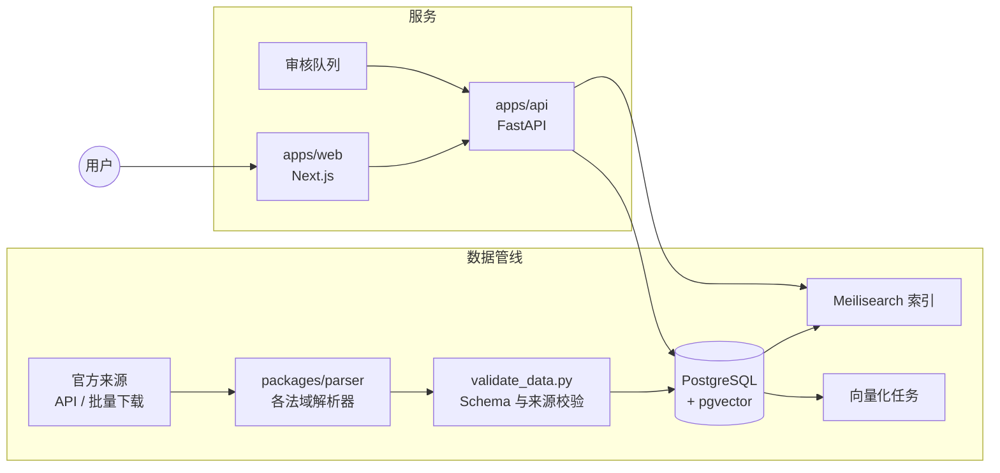

# 架构设计 Architecture

## 关键设计决策

1. **原文不可变，译文可替换**：`provisions.text` 只存官方原文；所有译文放在 `provision_translations`，并按 `official > reviewed > machine` 的优先级展示。
2. **版本化**：以 `document_versions` 的 `effective_from/effective_to` 支持时点查询，这是法律数据库区别于普通知识库的核心能力。
3. **永久 URI**：`/{法域}/{类型}/{年份}/{名称}#{条文路径}`，方便在文章、评论中引用，也方便外部网站链接。
4. **跨法域对照**：通过 `provision_relations(relation='comparable')` 与 `glossary_terms.concept_key` 两条线建立对照，**不自动判定"等同"**，对照关系须人工审核。
5. **无关系链的社区**：数据层不存在好友、关注、私信表；互动只有公开评论、点赞、"有帮助"、举报。
6. **求助流程**：用户描述问题 → 语义检索推荐法条和案例 → 用户确认已脱敏 → 进入审核 → 公开 → 网友 / 认证律师回复 → 求助者采纳。

## 扩展方向

- 法域数量增长后，按法域拆分 Meilisearch 索引
- 为法条引用提供嵌入组件（第三方网站可引用条文卡片）
- 开放只读数据 API 与数据集定期发布（GitHub Releases）
